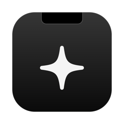

<div align="center">
  
  <h1>NotchAgent</h1>
  <p><b>A coding agent living in your Mac's notch.</b></p>
  <p>
    Hover the camera housing — or press <kbd>⌥</kbd><kbd>Space</kbd> — and a chat panel
    drops out of it. Talk to Claude Code, Codex, Cursor, or ChatGPT without leaving
    what you're doing. No window, no dock icon, no app switch.
  </p>
  <p>
    <a href="https://github.com/utmostelf5752/notch-agent/releases/latest/download/NotchAgent.dmg"></a>
    <a href="https://github.com/utmostelf5752/notch-agent/actions/workflows/release.yml"></a>
    
  </p>
  <p><a href="https://utmostelf5752.github.io/notch-agent/">Website</a> · <a href="#install">Install</a> · <a href="#build-from-source">Build from source</a> · <a href="#architecture">Architecture</a></p>
</div>

## What it does

- **Opens without stealing focus.** A Spotlight-style non-activating panel: it takes your keystrokes while the app you're in stays frontmost. Esc, <kbd>⌥</kbd><kbd>Space</kbd>, or a click outside closes it; the pin button keeps it up while you work elsewhere.
- **Drives the CLIs you're already signed into.** Messages go to the `claude`, `codex`, or Cursor `agent` CLI running headlessly, in a working folder you pick per chat — your accounts, your usage.
- **ChatGPT without an API key.** A hidden `WKWebView` logged into chatgpt.com sends prompts and scrapes replies. Sign in once; threads resume across restarts.
- **Streaming, with the work shown.** Claude streams token deltas; ChatGPT streams by polling the page. Tool activity renders live, then folds into an expandable "N steps" row.
- **Attachments.** Drag files onto the panel or the notch itself, or capture a screenshot (full screen / active window) from the paperclip menu.
- **Persistent chats.** Conversations archive to `~/Library/Application Support/NotchAgent/chats.json` with provider and session ids; restoring one continues it.

## Install

[**Download NotchAgent.dmg**](https://github.com/utmostelf5752/notch-agent/releases/latest/download/NotchAgent.dmg) — always the newest build from `main`, published by CI — and drag it to Applications.

The app is ad-hoc signed (no Apple Developer ID), so Gatekeeper blocks the first launch. Right-click the app and choose **Open**, then confirm — or:

```sh
xattr -dr com.apple.quarantine /Applications/NotchAgent.app
```

The CLI providers assume `claude` / `codex` / `agent` are installed and authenticated (or `CURSOR_API_KEY` is set for Cursor). ChatGPT needs no CLI — first use pops a one-time chatgpt.com sign-in window (email/passkey login is safest; Google SSO may refuse embedded web views).

## Controls

| Action | How |
|---|---|
| Open (no keyboard capture) | Hover the notch, 0.15s dwell |
| Open with keyboard focus | Click the notch, or <kbd>⌥</kbd><kbd>Space</kbd> anywhere |
| Close | Esc, <kbd>⌘</kbd><kbd>W</kbd>, <kbd>⌥</kbd><kbd>Space</kbd>, or click outside (unless pinned) |
| Send / newline | Return / <kbd>⌥</kbd>Return |
| Provider & folder | Dropdown pills in the composer (folder hidden for ChatGPT) |
| Settings, pin, new chat, history | Top strip flanking the notch cutout |
| Debug | `kill -USR1 <pid>` toggles debug; `kill -USR2 <pid>` runs commands from `/tmp/notchagent-cmd` (`provider:X` / `send:text` / `msgs` / `dump`) |

A sparkle icon in the menu bar shows the app is running and animates while a turn is in flight. Quit from the settings gear, <kbd>⌘</kbd><kbd>Q</kbd> while the panel is open, or `pkill NotchAgent`.

## Build from source

```sh
./build.sh                # swiftc build into build/NotchAgent.app
open build/NotchAgent.app # launches with no dock icon
./make-dmg.sh             # optional: package build/NotchAgent.dmg
```

`build.sh` uses raw `swiftc` (not `swift build`) so it works on a Command Line Tools-only machine — see [Toolchain notes](#toolchain-notes).

## Architecture

Two borderless windows at status-bar level, on all Spaces:

- **Target window** (`NotchTargetView`): notch-sized, always visible, pure black so it's invisible over the real notch. Never becomes key, so it can never steal keyboard focus. On displays without a notch, a small black tab is drawn at the top center instead.
- **Chat panel** (`NotchPanel`, an `NSPanel` with `.nonactivatingPanel` + `canBecomeKey`): Spotlight-style — takes keyboard input without activating the app. Ordered out on collapse, which hands focus back.

Open/close is a reveal: content is laid out in place and a top-anchored mask wipes down over it (timingCurve `0.16, 1, 0.3, 1`, 0.4s) — no bounce, no motion of the content itself.

Notch geometry comes from `NSScreen.safeAreaInsets` + `auxiliaryTopLeft/RightArea`. Hover detection is a 0.1s mouse-position poll over the notch target; closing is global + local mouseDown monitors — a click landing in none of the app's windows collapses the panel unless pinned. The global hotkey uses Carbon `RegisterEventHotKey`, which needs no accessibility permission.

### Agent transport (`AgentSession`)

CLI backends spawn per turn (except Codex's long-lived app-server), emit JSONL on stdout, and thread by session id:

| Provider | Transport | Threading |
|---|---|---|
| Claude | `claude -p --output-format stream-json --verbose --include-partial-messages` | session id from `result`, continued with `--resume` |
| Codex | `codex app-server` JSON-RPC (long-lived) | thread id from `openThread`; `item.completed` items map to bubbles |
| Cursor | `agent -p --output-format stream-json --stream-partial-output` | session id from `system`/`result`, continued with `--resume` |
| ChatGPT | hidden `WKWebView` on chatgpt.com | conversation id from `/c/<id>` URLs |

### ChatGPT provider (`ChatGPTWeb.swift`)

Prompts are injected with `document.execCommand('insertText')` into the first *visible* composer candidate (chatgpt.com keeps a `display:none` fallback textarea that poisons naive selectors — filter by `getClientRects().length`), then `button[data-testid='send-button']` is clicked. Replies are scraped from `[data-message-author-role='assistant']`; completion is two consecutive stable-text polls with no Stop button. Chat only — no local file access, so Auto-edit hides for this provider. Inherently fragile to chatgpt.com UI changes. Attachments are real byte uploads injected into the site's file input (10 MB/file cap).

`Support/chatgpt-bridge/` is the superseded first attempt (Node + Playwright-over-CDP); kept for reference, no longer called.

## Toolchain notes

Quirks of building on a CLT-only machine (no Xcode):

- `swift build` fails (swift-package dyld error), hence `build.sh` with raw `swiftc`.
- The macOS SDK's SwiftUI `@State` is macro-backed and the CLT lacks the SwiftUIMacros plugin, so `@State` does not compile. All view state lives in `ObservableObject`s (`@Published` + `@ObservedObject`). Avoid `@State`/`@StateObject` until Xcode is installed.
- An Info.plist is embedded into the bare executable (`-sectcreate __TEXT __info_plist`, wired into both `Package.swift` and `build.sh`) so `swift run`/Xcode SPM runs have a bundle identifier — without one, AppIntents/linkd registration and window-tab indexing spam the console. Remaining `com.apple.linkd` Code=4097 noise on macOS 27 beta is an OS-wide daemon issue, not the app; filter "linkd" in the console.

## Known limitations

- Markdown rendering in replies is partial.
- Screen/display changes (unplugging a monitor, resolution change) don't reposition the windows; restart the app.
- Interactive permission prompts are impossible in `-p` mode — the agent can't use un-allowed tools unless Auto-edit is on. A real product would use the Agent SDK and render permission requests in the panel.
- Ad-hoc signed only; every download needs the Gatekeeper dance above.
